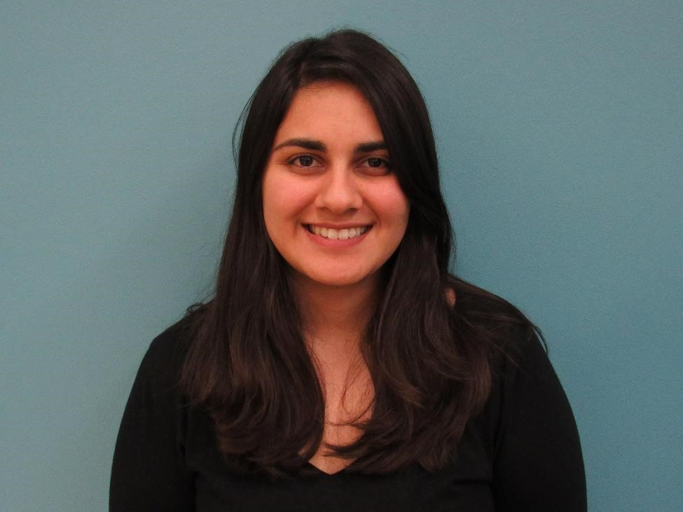

{:height="200px" align="left" style="margin-right:15px; margin-bottom:0px"}
Negeen Aghassibake is the Data Visualization Librarian at the University of Washington Health Sciences Library. She received her MS in Information Studies from the University of Texas at Austin in May 2018. Her areas of interest include data literacy and equity, diversity, and inclusion efforts in libraries.
