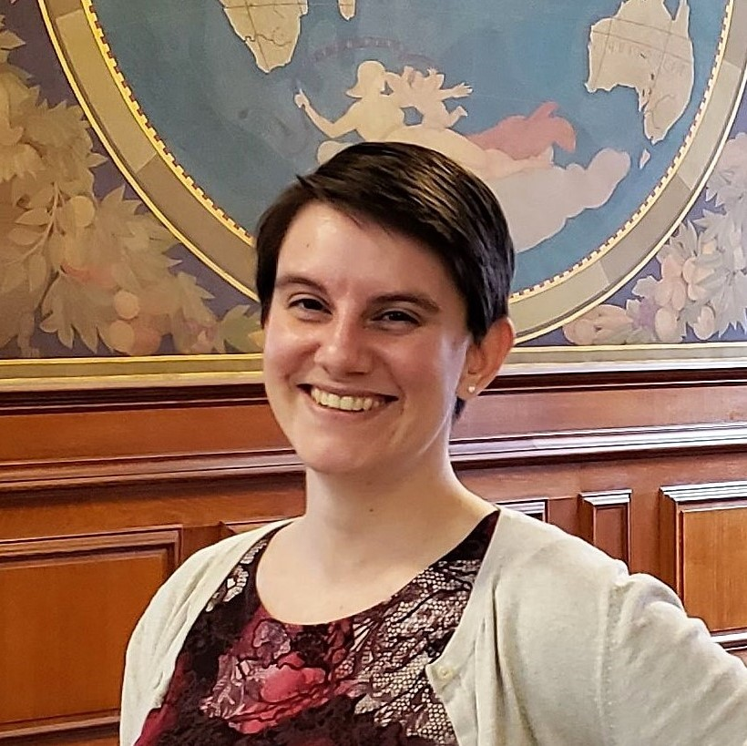

{:height="200px" align="left" style="margin-right:15px; margin-bottom:0px"}
As the Data Analytics & Visualization Librarian at the University of Illinois at Urbana-Champaign, Megan promotes best practices in data visualization to the campus community, including designing and teaching workshops and consulting with researchers. Her research into the ethics of data visualization allows her to integrate day-to-day practice with theory and critical studies. She is excited to join the Visualizing the Future team and help shape the growing field of data visualization in libraries. (Note: starting Spring 2020, Megan Ozeran is a Public Services Librarian at Folsom Lake College.)
