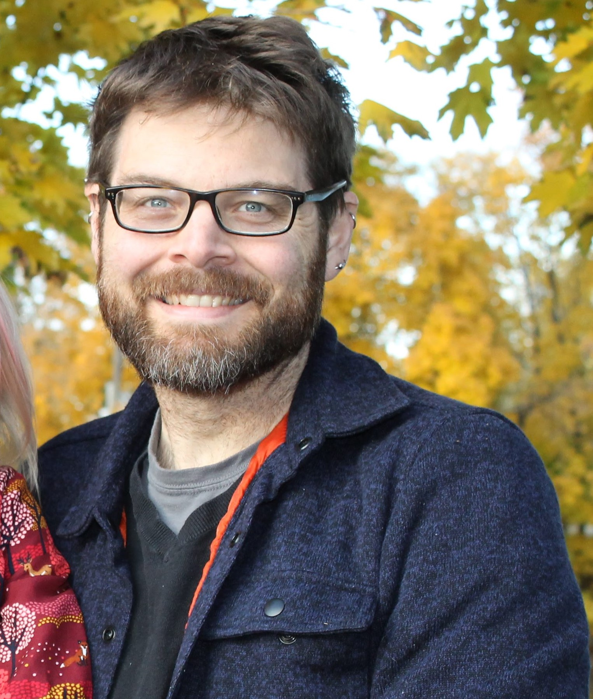

{:height="200px" align="left" style="margin-right:15px; margin-bottom:0px"}
Matthew Sisk is the GIS and Anthropology Librarian in the Navari Family Center for Digital Scholarship at the University of Notre Dame. His research focuses on human- environment interactions, the spatial scale environmental toxins and community-based research.  At Notre Dame, his primary role is to assist students and faculty with general GIS questions, satellite imagery analysis, data visualization, workflow automation, coding and data curation.
